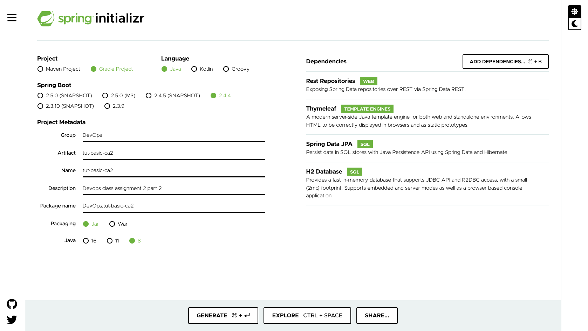
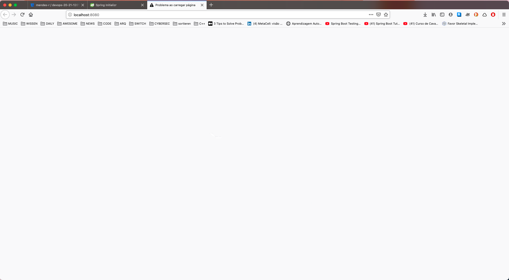
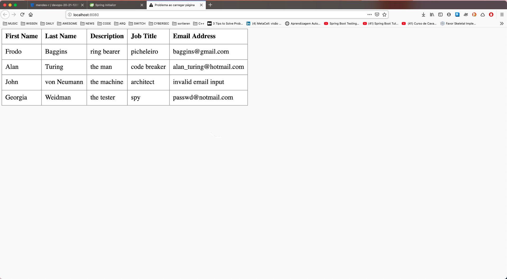
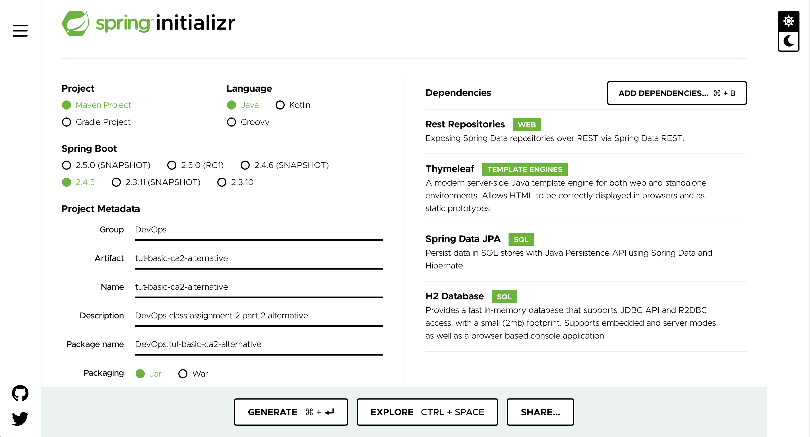

# Class Assignment 2 - part 2 Report

Topic of this assignment: Build Tools with Gradle

>_Converting the basic version (i.e., "basic" folder) of the Tutorial application to Gradle (instead of Maven)_


## 1. Analysis, Design and Implementation

### **1.1 Gradle, an open-source build automation tool**

[Gradle](https://gradle.org/) is a tool that uses scripts written in Groovy or Kotlin DSL to automate your builds. It's open-source and highly customizable.

>_Gradle is the official build tool for Android, and comes with support for many popular languages and technologies."_ 

This makes Gradle currently one of the most used build tools.

### **1.2 Assignment**

The goal of the Part 2 of this assignment is converting the basic version of the Tutorial application from Maven to Gradle.

The following steps will guide us in this process.

### **1.2.1 Create a new branch and new folder for the class assignment**

We will create a new branch for the propose of this new assignment.

```console
❯ pwd
.../devops-20-21-1201779

❯ git checkout -b tut-basic-gradle

❯ git status
No ramo tut-basic-gradle

❯ mkdir -p ./ca2/part2

❯ touch ./ca2/part2/README.md
```

The first and second command confirm our current working directory and creates a new branch called _tut-basic-gradle_.
As specified in the assignment, we will import the project to a folder named _part2_ inside the folder _ca2_.

As an extra, the last command creates this _readme_ file without content.

_All git related dynamics will be from now on omitted._

### **1.2.2 Add new gradle project**

To start a new Gradle project we will be using the [spring initializer](https://start.spring.io/) website. Here we can generate all the necessary spring project specifics in a intuitive and quick way.

The below shown image demonstrates the selected specifications.



We selected here the option _Gradle Project_ and gave the name _tut-basic-ca2_ to the project. 
Packaging is _Jar_ and the Java version is number 8.

We also added some dependencies that are needed for the Tutorial application: 
  - _Rest repository_,
  - _Thymeleaf_,
  - _Spring Data JPA_
  - and _H2 Database_.

To download the project template we click on the _Generate_ button.

The _zip_ file was send to the _Download_ folder on my machine.

The following command show us the _unzipping_ and import of our download project template to the working directory.

```console
❯ pwd
.../devops-20-21-1201779

❯ cd ca2/part2

❯ unzip ~/Downloads/tut-basic-ca2.zip

❯ ls -1
README.md	
tut-basic-ca2
```

Now let us commit the last changes to our repository.

```console
❯ git add .

❯ git commit -m <commit_message>
	
❯ git pull

❯ git push --set-upstream origin tut-basic-gradle

Enumerating objects: 26, concluído.
A contar objetos: 100% (26/26), concluído.
Delta compression using up to 8 threads
A comprimir objetos: 100% (17/17), concluído.
A escrever objetos: 100% (24/24), 5.73 KiB | 158.00 KiB/s, concluído.
Total 24 (delta 1), reused 0 (delta 0), pack-reused 0
remote:
remote: Create pull request for tut-basic-gradle:
remote:   https://bitbucket.org/mendes-r/devops-20-21-1201779/pull-requests/new?source=tut-basic-gradle&t=1
remote:
To https://bitbucket.org/mendes-r/devops-20-21-1201779.git
 * [new branch]      tut-basic-gradle -> tut-basic-gradle
Branch 'tut-basic-gradle' set up to track remote branch 'tut-basic-gradle' from 'origin'.
```

_All git related dynamics will be from now on omitted._

We now have an "empty" spring application that can be built using Gradle. You can check the available _gradle tasks_ by executing _./gradlew_ tasks.

```console
❯ pwd
.../devops-20-21-1201779/ca2/part2

❯ cd tut-basic-ca2
❯ ./gradlew tasks
Downloading https://services.gradle.org/distributions/gradle-6.8.3-bin.zip
..........10%..........20%..........30%...........40%..........50%..........60%..........70%...........80%..........90%..........100%
Starting a Gradle Daemon (subsequent builds will be faster)

> Task :tasks

------------------------------------------------------------
Tasks runnable from root project 'tut-basic-ca2'
------------------------------------------------------------

Application tasks
-----------------
bootRun - Runs this project as a Spring Boot application.

Build tasks
-----------
assemble - Assembles the outputs of this project.
bootBuildImage - Builds an OCI image of the application using the output of the bootJar task
...
```

### **1.2.3 Import _src_ from class assignment 1 to the new gradle project**

Before importing the project from the first class assignment, we need to delete the _src_ folder.

```console
❯ ls
HELP.md		build.gradle	gradle		gradlew		gradlew.bat	settings.gradle	src

❯ rm -rf src
❯ ls
HELP.md		build.gradle	gradle		gradlew		gradlew.bat	settings.gradle
```

We can now import the Tutorial application from class assignment 1 to the _tut-basic-ca2_ folder. For that, we will just need to copy the _src_ from the first class assignment as well as the _webpack.config.js_ and _package.json_ files.
We can see this process below by using the command line interface:

```console
❯ cp -r ../../../ca1/tut-basic/src .
❯ cp -r ../../../ca1/tut-basic/webpack.config.js .
❯ cp -r ../../../ca1/tut-basic/package.json .
❯ rm -rf src/main/resources/static/built
❯ ls -1
HELP.md
build.gradle
gradle
gradlew
gradlew.bat
package.json
settings.gradle
src
webpack.config.js
```

To confirm that everything is in the right place, let's start our server by running the _./gradlew bootRun_ command:

```console
❯ ./gradlew bootRun
> Task :bootRun

  .   ____          _            __ _ _
 /\\ / ___'_ __ _ _(_)_ __  __ _ \ \ \ \
( ( )\___ | '_ | '_| | '_ \/ _` | \ \ \ \
 \\/  ___)| |_)| | | | | || (_| |  ) ) ) )
  '  |____| .__|_| |_|_| |_\__, | / / / /
 =========|_|==============|___/=/_/_/_/
 :: Spring Boot ::                (v2.4.4)
 
 ...
 
 <==========---> 80% EXECUTING [26s]
 > :bootRun
```

Let's try to open our browser on the _http://localhost:8080_.



It seems that it isn't working.
This is because Gradle is missing the plugin for dealing with the frontend code.

### **1.2.4 Add org.siouan.frontend**

To deal with the problem from the last step we need to add the gradle plugin [org.siouan.frontend](https://github.com/Siouan/frontend-gradle-plugin) to our project.

Add the following line to the plugins block in build.gradle:

```console
id "org.siouan.frontend" version "1.4.1"
```

Add also the following code in build.gradle to configure the previous plugin:

```console
frontend {
   nodeVersion = "12.13.1"
   assembleScript = "run webpack"
}
```

Update the scripts section/object in package.json to configure the execution of webpack (second line inside "scripts"):

```console
"scripts": {
  "watch": "webpack --watch -d",
  "webpack": "webpack"
 },
```

Let's try run the server again.

```console
❯ ./gradlew build
> Task :installNode
...
> Task :installFrontend
...
> Task :assembleFrontend
...
BUILD SUCCESSFUL in 2m 35s
9 actionable tasks: 9 executed

❯ ./gradlew bootRun
  .   ____          _            __ _ _
 /\\ / ___'_ __ _ _(_)_ __  __ _ \ \ \ \
( ( )\___ | '_ | '_| | '_ \/ _` | \ \ \ \
 \\/  ___)| |_)| | | | | || (_| |  ) ) ) )
  '  |____| .__|_| |_|_| |_\__, | / / / /
 =========|_|==============|___/=/_/_/_/
 :: Spring Boot ::                (v2.4.4)
 
 ...
 
 <==========---> 80% EXECUTING [2m 25s]
 > :bootRun
```
Let's try to open our browser again on the _http://localhost:8080_.



Great!

### **1.2.5 Create a task to copy jar file**

To create an task in Gradle with just need to add a script to the _build.gradle_ file.

The task has the following configuration to be able to copy the _jar_ file inside the _./build/libs/_ folder to the _dist_ folder.

```console
task copyJAR (type: Copy){
	group = "DevOps"
	description = "Makes a copy of the .jar file to the dist folder"

	from 'build/libs/'
	into 'dist'
}
```

If the _dist_ folder was not created yet, the task, when called will create it.

```console
❯ ./gradlew copyJAR

BUILD SUCCESSFUL in 4s
1 actionable task: 1 executed

❯ ls dist
tut-basic-ca2-0.0.1-SNAPSHOT.jar
```

### **1.2.6 New task to delete all the files generated by webpack**

The created task to delete all the files generated by webpack
(usually located at src/resources/main/static/built/) has the below shown configuration.

```console
task deleteBuilt(type: Delete){
	group = "DevOps"
	description = "Delete all the files generated by webpack"

	delete "${rootDir}/src/main/resources/static/built/"
}

clean.configure {
	dependsOn(deleteBuilt)
}
```

The task is for type _Delete_.
The _delete_ property sets the directory where wanted deleted files are located.

This new task should be executed automatically by gradle before the task clean.

To do this we need to configure the _clean_ task through a task provider. This is shown on the last lines of the code above.

Now let's try to run the new task:

```console
❯ ./gradlew --console=plain clean
> Task :cleanFrontend SKIPPED
> Task :deleteBuilt
> Task :clean

BUILD SUCCESSFUL in 3s
2 actionable tasks: 2 executed

❯ ls src/main/resources/static/
main.css
```

All the files in _built_ folder incl. the folder itself was deleted when running the _clean_ command.

The _--console=plain_ flag give us more detail when running a command with _gradlew_ and confirms that the _deleteBuilt_ task was run when calling the _clean_ command.

### **1.2.7 Merge with master**

having the assignment completed, we can merge with the _master_ branch as following:

```console
❯ git checkout master
Mudou para o ramo 'master'
Your branch is up to date with 'origin/master'.

❯ git merge tut-basic-gradle

...

❯ git push
```

## 2. Analysis of an Alternative

### **2.1 Why Maven**

The alternative chosen for this class assignment will be [Maven](https://maven.apache.org/). Given that Maven was explicitly denied as an option, I will first justify my choice.

The application that is being developed on [SWITCH](https://portotechhub.com/switch/) uses Maven as the build tool. Unfortunately, I feel that I do not understand this tool as well as I now understand Gradle. To fill the gap, I tried to start a Maven project from scratch, ignoring that the Tutorial Application already was using this building tool.

Although conscious that this alternative will not fullfil the requirements of this class assignment, the following chapters on this report will give a quick look on the research an refactoring that I made to better deal with Maven.

### **2.2 Maven, pros and cons**

_Apache Maven_ is a build tool and project manager based on the concept of a project object model (POM). 
POM is the base unit of work in Maven. It is a file in XML that as all the information and configurations need to build the project.

Maven in open source and the community around it is big and very active. That helps any person willing to give a first step into this tool dynamics.

Another important concept in Maven is the Build Lifecycle. This means that the build process of a project is already well defined. There are three built-in build lifecycles: default, clean and site: _default_ (project deployment), _clean_ (project cleaning) and _site_ (projects' site documentation). 

The _default_ lifecycle is comprise of several phases: _validate, compile, test, package, verify, install and deploy_. Theses phases are run sequentially.

All these pre-defined phases makes Maven a ready-to-use tool but also a less flexible one.

During the assignment, described bellow, it was very clear that Maven can be a lot more verbose in comparison with Gradle. Using a markup language as XML to describe configurations or new tasks is not very _user-friendly_ when compared with a scripting type as we saw with Gradle.

The creation of new tasks as defined in Gradle is somewhat more complicated with Maven. There are already a lot of highly customizable Maven plugins that can answer to this class assignment. Yet, if you want something more special the only way to do that is by developing your own Maven-plugin.

Maven has less performance compared with Gradle, [source](https://gradle.org/maven-vs-gradle/), and that is something that has a significant importance to ship software faster.

And last but not least, Maven as a steep learning curve. This is something that I can surely confirm.

## 3. Implementation of the Alternative

### **3.1.1 Create a maven project**

To instal Maven through the command line interface CLI the following command was run. This command only works on MacOS with the package management tool called [Homebrew](https://brew.sh/)

```console
❯ brew install maven
...

❯ mvn --version
Apache Maven 3.8.1 (05c21c65bdfed0f71a2f2ada8b84da59348c4c5d)
Maven home: /Users/ricardomendes/.sdkman/candidates/maven/current
Java version: 11.0.9, vendor: Oracle Corporation, runtime: /Library/Java/JavaVirtualMachines/jdk-11.0.9.jdk/Contents/Home
Default locale: pt_PT, platform encoding: UTF-8
OS name: "mac os x", version: "10.16", arch: "x86_64", family: "mac"
```
To start a new Maven project we will be using the [spring initializer](https://start.spring.io/) website. Here we can generate all the necessary spring project specifics in a intuitive and quick way.

The below shown image demonstrates the selected specifications.



We selected here the option _Maven Project_ and gave the name _tut-basic-ca2-alternative_ to the project.
Packaging is _Jar_ and the Java version is number 8.

We also added some dependencies that are needed for the Tutorial application: 
  - _Rest repository_,
  - _Thymeleaf_,
  - _Spring Data JPA_
  - and _H2 Database_.

To download the project template we click on the _Generate_ button.

The _zip_ file was send to the _Download_ folder on my machine.

The following command show us the _unzipping_ and import of our download project template to the working directory.

```console
❯ pwd
.../devops-20-21-1201779

❯ cd ca2/part2

❯ unzip ~/Downloads/tut-basic-ca2-alternative.zip

❯ ls -1
README.md
img
tut-basic-ca2
tut-basic-ca2-alternative
```

We could also use a Maven command to start a project. Here is a default example:

```console
mvn archetype:generate -DgroupId=com.mycompany.app -DartifactId=my-app -DarchetypeArtifactId=maven-archetype-quickstart -DarchetypeVersion=1.4 -DinteractiveMode=false
```

To add the dependencies, the best way is still to edit the POM file.

## **3.1.2 Import _src_ from class assignment 1 to the new maven project**

_There is here a redundancy, we are transferring a maven project to another maven project. To respect the class assignment, just the src folder and two .js files are transfered._

Before importing the project from the first class assignment, we need to delete the _src_ folder.

```console
❯ pwd
/devops-20-21-1201779/ca2/part2/tut-basic-ca2-alternative

❯ ls
HELP.md		mvnw		mvnw.cmd	pom.xml		src

❯ rm -rf src
❯ ls
HELP.md		mvnw		mvnw.cmd	pom.xml
```

We can now import the Tutorial application from class assignment 1 to the _tut-basic-ca2_ folder. For that, we will just need to copy the _src_ from the first class assignment as well as the _webpack.config.js_ and _package.json_ files.
We can see this process below by using the command line interface:

```console
❯ cp -r ../../../ca1/tut-basic/src .
❯ cp -r ../../../ca1/tut-basic/webpack.config.js .
❯ cp -r ../../../ca1/tut-basic/package.json .
❯ rm -rf src/main/resources/static/built
❯ ls -1
HELP.md
mvnw
mvnw.cmd
package.json
pom.xml
src
webpack.config.js
```

```console
❯ ./mvnw spring-boot:run


  .   ____          _            __ _ _
 /\\ / ___'_ __ _ _(_)_ __  __ _ \ \ \ \
( ( )\___ | '_ | '_| | '_ \/ _` | \ \ \ \
 \\/  ___)| |_)| | | | | || (_| |  ) ) ) )
  '  |____| .__|_| |_|_| |_\__, | / / / /
 =========|_|==============|___/=/_/_/_/
 :: Spring Boot ::                (v2.4.5)

2021-04-18 15:08:59.616  INFO 2289 --- [           main] c.g.p.ReactAndSpringDataRestApplication  : Starting ReactAndSpringDataRestApplication using Java 11.0.9 on Air-de-Ricardo.lan with PID 2289 (/Users/ricardomendes/Documents/RicardoSync/01_Temas/01_Code/00_Pos-Graduação/Switch/10_Projects/devops-20-21-1201779/ca2/part2/tut-basic-ca2-alternative/target/classes started by ricardomendes in /Users/ricardomendes/Documents/RicardoSync/01_Temas/01_Code/00_Pos-Graduação/Switch/10_Projects/devops-20-21-1201779/ca2/part2/tut-basic-ca2-alternative)

...
```

Let's try to open our browser on the _http://localhost:8080_.


Nothing on the screen.
This is because Maven is missing the plugin to deal with the frontend code.

### **3.1.3 Add eirslett-frontend-maven-plugin**

To deal with the problem from the last step we need to add the maven plugin [eirslett-frontend-maven-plugin](https://github.com/eirslett/frontend-maven-plugin) to our project.

To do this we need to add this lines to our POM file and inside the _plugins_ tag:

```console
<plugin>
	<groupId>com.github.eirslett</groupId>
	<artifactId>frontend-maven-plugin</artifactId>
	<version>1.6</version>
	<configuration>
		<installDirectory>target</installDirectory>
	</configuration>
	<executions>
		<execution>
			<id>install node and npm</id>
			<goals>
				<goal>install-node-and-npm</goal>
			</goals>
			<configuration>
				<nodeVersion>v10.11.0</nodeVersion>
				<npmVersion>6.4.1</npmVersion>
			</configuration>
		</execution>
		<execution>
			<id>webpack build</id>
			<goals>
				<goal>webpack</goal>
			</goals>
		</execution>
	</executions>
</plugin>
```

Node/npm will only be "installed" locally to our project. It will not be installed globally on the whole system (and it will not interfere with any Node/npm installations already present).

The module bundler Webpack is also here described with the execution tag.
This tag is used to configure a plugin. This is something already talked on chapter 2.2; giving that Maven is so well defined, it almost prevent us to personalized something that is different from the build lifecycle.

With the plugin installed, let's try to run the application again.

```console
❯ ./mvnw spring-boot:run


  .   ____          _            __ _ _
 /\\ / ___'_ __ _ _(_)_ __  __ _ \ \ \ \
( ( )\___ | '_ | '_| | '_ \/ _` | \ \ \ \
 \\/  ___)| |_)| | | | | || (_| |  ) ) ) )
  '  |____| .__|_| |_|_| |_\__, | / / / /
 =========|_|==============|___/=/_/_/_/
 :: Spring Boot ::                (v2.4.5)

2021-04-18 15:08:59.616  INFO 2289 --- [           main] c.g.p.ReactAndSpringDataRestApplication  : Starting ReactAndSpringDataRestApplication using Java 11.0.9 on Air-de-Ricardo.lan with PID 2289 (/Users/ricardomendes/Documents/RicardoSync/01_Temas/01_Code/00_Pos-Graduação/Switch/10_Projects/devops-20-21-1201779/ca2/part2/tut-basic-ca2-alternative/target/classes started by ricardomendes in /Users/ricardomendes/Documents/RicardoSync/01_Temas/01_Code/00_Pos-Graduação/Switch/10_Projects/devops-20-21-1201779/ca2/part2/tut-basic-ca2-alternative)

...
```


Well done!

### **3.1.4 New action to copy the .jar file**

To answer to this task we will be using the [Maven-Resource-Plugin](https://maven.apache.org/plugins/maven-resources-plugin/). This plugin enable us to copy project resources.

To add the plugin we just need to copy the code below not our POM file.

```console
<plugin>
	<artifactId>maven-resources-plugin</artifactId>
	<version>3.2.0</version>
	<executions>
		<execution>
			<id>copy-resources</id>
			<phase>install</phase>
			<goals>
				<goal>copy-resources</goal>
			</goals>
			<configuration>
				<outputDirectory>${basedir}/dist</outputDirectory>
				<resources>
					<resource>
						<directory>${basedir}/target</directory>
						<includes>
							<include>*.jar</include>
						</includes>
						<filtering>true</filtering>
					</resource>
				</resources>
			</configuration>
		</execution>
	</executions>
</plugin>
```

The _outputDirectory_ tag specifies the destination of the copied files.

The _directory_ tag inside the _resource_ tag defines the location of the files or directories that we want to copy.
Because we only want to copy the _.jar_ files, we will use the _include_ tag and a _*.jar_ to say that only files with the _jar_ extension should matter.

We decide to include this new "task" during the _install_ phase:

```console
❯ mvn install
...
[INFO] --- maven-resources-plugin:3.2.0:copy-resources (copy-resources) @ tut-basic-ca2-alternative ---
[INFO] Using 'UTF-8' encoding to copy filtered resources.
[INFO] Using 'UTF-8' encoding to copy filtered properties files.
[INFO] Copying 1 resource
...

❯ ls dist
tut-basic-ca2-alternative-0.0.1-SNAPSHOT.jar
```

### **3.1.5 New action to delete all the files generated by webpack**

To answer to this task we need to use the [Maven-Clean.Plugin](https://maven.apache.org/plugins/maven-clean-plugin/). This plugin is used when you want to remove files generated at build-time.

```console
<plugin>
	<artifactId>maven-clean-plugin</artifactId>
	<configuration>
		<filesets>
			<fileset>
				<directory>${basedir}/src/main/resources/static/built</directory>
			</fileset>
		</filesets>
	</configuration>
</plugin>
```

The _directory_ tag specifies the directory of the files that we want to delete.
This "tag" is run during the clean phase.

```console
❯ ls ./src/main/resources/static/built
bundle.js	bundle.js.map

❯ mvn clean
...
[INFO] Deleting /Users/ricardomendes/Documents/RicardoSync/01_Temas/01_Code/00_Pos-Graduação/Switch/10_Projects/devops-20-21-1201779/ca2/part2/tut-basic-ca2-alternative/src/main/resources/static/built (includes = [], excludes = ....

❯ ls ./src/main/resources/static/built
ls: ./src/main/resources/static/built: No such file or directory
```

## 4 An extra about plugins

The development of a plugin for Maven has its own process and is a little bit independent from the Maven build tool.

In the official website, Maven is described as follows:

> "Maven" is really just a core framework for a collection of Maven Plugins. In other words, plugins are where much of the real action is performed, (...) Almost any action that you can think of performing on a project is implemented as a Maven plugin.

If you want a specific action that isn't provide by already built plugins, you need to make your own plugin.

A Maven plugin is constitute by goals that are named _mojos_. Any plugin consists of any number of goals. Any of this goals are bound to a specific phase in the Maven build lifecycle.

In terms of implementation, a _mojo_ can be a Java class that extends AbstractMojo (import org.apache.maven.plugin.AbstractMojo) with a _@Mojo_ annotation. And with Java we can code our new plugin with personalized goals and functions.

Curiously, to build a Maven plugin we use a Maven project that defines on its POM file the _packaging_ tag as _maven-plugin_.

[source](https://maven.apache.org/guides/plugin/guide-java-plugin-development.html)

There is a lot more complexity in building plugins. To known more about it I can recommend this [site](https://maven.apache.org/guides/mini/guide-configuring-plugins.html)


THE END