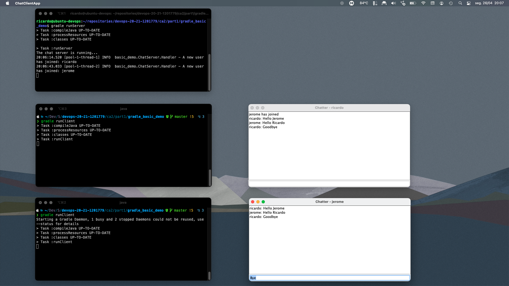

# Class Assignment 3 - part 1 Report

Topic of this assignment: Virtualization with Vagrant

>_Practice with VirtualBox using the same projects from the previous assignments but now inside a VirtualBox VM with Ubuntu_

## 1. Analysis, Design and Implementation

### **1.1 VirtualBox**

[VirtualBox](https://www.virtualbox.org/) is an hypervisor that can run within an host OS.

It can run on many different OS and supports a large number of guest operation systems.

It is frequently updated and is widely used on a enterprise, and also on a home context.

### **1.2 Assignment**

This class assignment can be divided in 2 parts: the virtual machine (VM) configuration using VirtualBox and a second part with a more exploratory goal: using the same projects from the previous assignments but now inside a VirtualBox VM with Ubuntu.

### **1.3 VM configuration**

The VM configuration was made available during the class.

It would be a repetitive task to describe it here step by step.

As an alternative I will summarize some aspects that I see as relevant for this assignment:

- As already mentioned, VirtualBox is a Hosted virtualization tool, the hypervisor runs on the Host OS.
  
- The guest OS is a Linux distribution called Ubuntu version 18.04. A minimal installation iso will be used meaning that we will not have an user interface to interact with it. The command line interface (CLI) will be used.
  
- To the VM we need to add a second network adapter. This adapter is host-only and enables a connection between the host and the guest machine. After the OS installation, we need to assign an IP address to the machine by editing this configuration file: _/etc/netplan/01-netcfg.yaml_.

- To have the possibility to access the guest machine remotely we need to install a _ssh_ server.

- To be able to transfer files between guest and host machine we need to install an _sftp_ server as well.

### **1.4 Accessing guest machine from host**

First let's confirm, on our guest machine, the IP address by running the _ifconfig_ command.

```console
guest$ ifconfig

enp0s3: flags=4163<UP,BROADCAST,RUNNING,MULTICAST>  mtu 1500
        inet 10.0.2.15  netmask 255.255.255.0  broadcast 10.0.2.255
        inet6 fe80::a00:27ff:fe64:49c0  prefixlen 64  scopeid 0x20<link>
        ether 08:00:27:64:49:c0  txqueuelen 1000  (Ethernet)
        RX packets 67743  bytes 97292473 (97.2 MB)
        RX errors 0  dropped 0  overruns 0  frame 0
        TX packets 30930  bytes 2214480 (2.2 MB)
        TX errors 0  dropped 0 overruns 0  carrier 0  collisions 0

enp0s8: flags=4163<UP,BROADCAST,RUNNING,MULTICAST>  mtu 1500
        inet 192.168.56.5  netmask 255.255.255.0  broadcast 192.168.56.255
        inet6 fe80::a00:27ff:fe30:1130  prefixlen 64  scopeid 0x20<link>
        ether 08:00:27:30:11:30  txqueuelen 1000  (Ethernet)
        RX packets 29110  bytes 1935807 (1.9 MB)
        RX errors 0  dropped 0  overruns 0  frame 0
        TX packets 28812  bytes 3224099 (3.2 MB)
        TX errors 0  dropped 0 overruns 0  carrier 0  collisions 0

lo: flags=73<UP,LOOPBACK,RUNNING>  mtu 65536
        inet 127.0.0.1  netmask 255.0.0.0
        inet6 ::1  prefixlen 128  scopeid 0x10<host>
        loop  txqueuelen 1000  (Loopback Local)
        RX packets 209  bytes 35033 (35.0 KB)
        RX errors 0  dropped 0  overruns 0  frame 0
        TX packets 209  bytes 35033 (35.0 KB)
        TX errors 0  dropped 0 overruns 0  carrier 0  collisions 0
```

192.168.56.5 is our IP address.

To access our VM we need to open a terminal window on our host machine and use the Secure Shell protocol to make the connection.

```console
host$ ssh ricardo@192.168.56.5
password ...
```

We have contact!

_ricardo_ is the user name. We could use _root_ or other defined user of the guest OS.

### **1.5 Guest OS configurations - install dependencies**

To be able to answer to the class assignment more configurations are needed.

Let's start with git to be able to clone the project:

```console
guest$ sudo apt install git-all
```

Given that we need to install a lot of different software developing tools, it is a good idea to have a kind of manager.

[SDKMan](https://sdkman.io/) will do the trick.

But even before that, the _zip_ and _curl_ programs, must be installed. The following command will help us with that:

```console
guest$ sudo apt install zip

guest$ sudo apt install curl
```

So, now we can install the Software Development Kits Manager:

```console
guest$ curl -s "https://get.sdkman.io" | bash

guest$ source "$HOME/.sdkman/bin/sdkman-init.sh"

guest$ sdk version

SDKMAN 5.11.0+644
```

First we will install a Java Development Kit (JDK). We chose the version 11 because is the same that we have on our host machine.

For that let's use SDK. To see all the available versions use the _list_ command as following.

```console
guest$ sdk list java
================================================================================
Available Java Versions
================================================================================
 Vendor        | Use | Version      | Dist    | Status     | Identifier
--------------------------------------------------------------------------------
 
 (...)

 Azul Zulu     |     | 16.0.0       | zulu    |            | 16.0.0-zulu
               |     | 16.0.0.fx    | zulu    |            | 16.0.0.fx-zulu
               |     | 15.0.2.fx    | zulu    |            | 15.0.2.fx-zulu
               |     | 11.0.11      | zulu    |            | 11.0.11-zulu
               |     | 11.0.10      | zulu    |            | 11.0.10-zulu
               |     | 11.0.10.fx   | zulu    |            | 11.0.10.fx-zulu
               |     | 8.0.292      | zulu    |            | 8.0.292-zulu
               |     | 8.0.282      | zulu    |            | 8.0.282-zulu
               |     | 8.0.282.fx   | zulu    |            | 8.0.282.fx-zulu
               |     | 7.0.302      | zulu    |            | 7.0.302-zulu
               |     | 7.0.292      | zulu    |            | 7.0.292-zulu
               |     | 6.0.119      | zulu    |            | 6.0.119-zulu
 BellSoft      |     | 16.0.1.fx    | librca  |            | 16.0.1.fx-librca
               |     | 16.0.1       | librca  |            | 16.0.1-librca
               |     | 16.0.0.fx    | librca  |            | 16.0.0.fx-librca
               |     | 16.0.0       | librca  |            | 16.0.0-librca
               |     | 11.0.11.fx   | librca  |            | 11.0.11.fx-librca
               |     | 11.0.11      | librca  |            | 11.0.11-librca
               |     | 11.0.10.fx   | librca  |            | 11.0.10.fx-librca
               |     | 11.0.10      | librca  |            | 11.0.10-librca
               |     | 8.0.292.fx   | librca  |            | 8.0.292.fx-librca
               |     | 8.0.292      | librca  |            | 8.0.292-librca
               |     | 8.0.282.fx   | librca  |            | 8.0.282.fx-librca
               |     | 8.0.282      | librca  |            | 8.0.282-librca
 GraalVM       |     | 21.1.0.r16   | grl     |            | 21.1.0.r16-grl
               |     | 21.1.0.r11   | grl     |            | 21.1.0.r11-grl
               |     | 21.1.0.r8    | grl     |            

(...)

================================================================================
Use the Identifier for installation:

    $ sdk install java 11.0.3.hs-adpt
================================================================================
```

To install the chosen version use the _install_ command:

```console
guest$ sdk install java 8.0.292-zulu

guest$ java --version

openjdk version "1.8.0_292"
OpenJDK Runtime Environment (Zulu 8.54.0.21-CA-linux64) (build 1.8.0_292-b10)
OpenJDK 64-Bit Server VM (Zulu 8.54.0.21-CA-linux64) (build 25.292-b10, mixed mode)
```

 Gradle will be also needed. We could just ignore this and run the build tool with the Gradle Wrapper script. But to enable a more versatile environment we choose to install it.

 The latest version will be installed.

```console
guest$ sdk install gradle 7.0

gradle --version

------------------------------------------------------------
Gradle 7.0
------------------------------------------------------------

Build time:   2021-04-09 22:27:31 UTC
Revision:     d5661e3f0e07a8caff705f1badf79fb5df8022c4

Kotlin:       1.4.31
Groovy:       3.0.7
Ant:          Apache Ant(TM) version 1.10.9 compiled on September 27 2020
JVM:          11.0.11 (Azul Systems, Inc. 11.0.11+9-LTS)
OS:           Linux 4.15.0-142-generic amd64
```

The same with Maven.

```console
guest$ sdk install maven 3.8.1

guest$ mvn --version

Apache Maven 3.8.1 (05c21c65bdfed0f71a2f2ada8b84da59348c4c5d)
Maven home: /home/ricardo/.sdkman/candidates/maven/current
Java version: 11.0.11, vendor: Azul Systems, Inc., runtime: /home/ricardo/.sdkman/candidates/java/11.0.11-zulu
Default locale: en_US, platform encoding: UTF-8
OS name: "linux", version: "4.15.0-142-generic", arch: "amd64", family: "unix"
```

### **1.6 Clone the project**

First we need a convenient directory to have a more organized environment:

```console
guest$ mkdir repositories/
guest$ cd $!
guest$ pwd
~/repositories
```

Let's clone the project to this new machine.

```console
guest$ git clone https://mendes-r@bitbucket.org/mendes-r/devops-20-21-1201779.git
```

Before going further we need to configure Git by defining a username and an email address.

```console
guest$ git config --global user.email <email>

guest$ git config --global user.name <name>
```

Now we are able to fully use Git.

### **1.7 Run the previous class assignments**

### **1.7.1 Class assignment 1**

The first class assignment uses Maven as a build tool.

```console
guest$ cd devops-20-21-1201779/ca1/tut-basic

guest$ mvn spring-boot:run

--2021-04-23 17:42:18--  https://repo.maven.apache.org/maven2/io/takari/maven-wrapper/0.5.5/maven-wrapper-0.5.5.jar
A resolver repo.maven.apache.org (repo.maven.apache.org)... 199.232.192.215, 199.232.196.215
A conectar repo.maven.apache.org (repo.maven.apache.org)|199.232.192.215|:443... conectado.
Pedido HTTP enviado, a aguardar resposta... 200 OK
Tamanho: 50710 (50K) [application/java-archive]
Salvando em: “/home/ricardo/repositories/devops-20-21-1201779/ca1/tut-basic/.mvn/wrapper/maven-wrapper.jar”

/home/ricardo/devOps/repositories/devops-20-21-1201779/ca1 100%[========================================================================================================================================>]  49,52K  --.-KB/s    em 0,06s

2021-04-23 17:42:22 (780 KB/s) - “/home/ricardo/repositories/devops-20-21-1201779/ca1/tut-basic/.mvn/wrapper/maven-wrapper.jar” salvo [50710/50710]

[INFO] Scanning for projects...

...

  .   ____          _            __ _ _
 /\\ / ___'_ __ _ _(_)_ __  __ _ \ \ \ \
( ( )\___ | '_ | '_| | '_ \/ _` | \ \ \ \
 \\/  ___)| |_)| | | | | || (_| |  ) ) ) )
  '  |____| .__|_| |_|_| |_\__, | / / / /
 =========|_|==============|___/=/_/_/_/
 :: Spring Boot ::        (v2.2.4.RELEASE)

 ...
 
```

On our host machine open a browser and go to the following URL: http://192.168.56.5:8080/

In the URL we can see the IP address of our guest machine and the and the port 8080, a popular alternative to port 80 for offering web services.


Perfect and smooth!

### **1.7.2 Class assignment 2 - part 1**

The second class assignment is divided in 2 parts.
The first part uses Gradle and is a little chat application.

```console
guest$ cd ~/repositories/devops-20-21-1201779/ca2/part1/gradle_basic_demo/

guest$ gradle runServer
Starting a Gradle Daemon, 1 incompatible and 1 stopped Daemons could not be reused, use --status for details
> Task :compileJava
> Task :processResources
> Task :classes

> Task :runServer
The chat server is running...
```

The server program runs!

```console
guest$ gradle runClient
> Task :compileJava UP-TO-DATE
> Task :processResources UP-TO-DATE
> Task :classes UP-TO-DATE

> Task :runClient FAILED
Exception in thread "main" java.awt.HeadlessException:
No X11 DISPLAY variable was set, but this program performed an operation which requires it.
	at java.desktop/java.awt.GraphicsEnvironment.checkHeadless(GraphicsEnvironment.java:208)
	at java.desktop/java.awt.Window.<init>(Window.java:548)
	at java.desktop/java.awt.Frame.<init>(Frame.java:423)
	at java.desktop/javax.swing.JFrame.<init>(JFrame.java:224)
	at basic_demo.ChatClient.<init>(ChatClient.java:35)
	at basic_demo.ChatClientApp.main(ChatClientApp.java:18)

FAILURE: Build failed with an exception.

* What went wrong:
Execution failed for task ':runClient'.
> Process 'command '/home/ricardo/.sdkman/candidates/java/11.0.11-zulu/bin/java'' finished with non-zero exit value 1

* Try:
Run with --stacktrace option to get the stack trace. Run with --info or --debug option to get more log output. Run with --scan to get full insights.

* Get more help at https://help.gradle.org

BUILD FAILED in 1s
3 actionable tasks: 1 executed, 2 up-to-date
```

The client program doesn't work. That's because our OS doesn't have an UI where to run the application.

So, let's try to run the server on the guest machine and the client on the host machine.

But before that we need to edit the gradle task that runs the client. That's because we now have the server on a different IP, not the localhost but the IP of our guest machine.

```console
task runClient(type:JavaExec, dependsOn: classes){
    group = "DevOps"
    description = "Launches a chat client that connects to a server on localhost:59001 "
  
    classpath = sourceSets.main.runtimeClasspath

    main = 'basic_demo.ChatClientApp'

    args '192.168.56.5', '59001'
}
```



### **1.7.3 Class assignment 2 - part 2**

The second parte of the second class assignment uses also Gradle:

```console 
 guest$ cd ~/repositories/devops-20-21-1201779/ca2/part2/tut-basic-ca2

guest$ gradle bootRun
 
 > Task :bootRun

   .   ____          _            __ _ _
  /\\ / ___'_ __ _ _(_)_ __  __ _ \ \ \ \
 ( ( )\___ | '_ | '_| | '_ \/ _` | \ \ \ \
  \\/  ___)| |_)| | | | | || (_| |  ) ) ) )
   '  |____| .__|_| |_|_| |_\__, | / / / /
  =========|_|==============|___/=/_/_/_/
  :: Spring Boot ::                (v2.4.4)
 
 ...

```


On our host machine open a browser and go to the following URL: [http://192.168.56.5:8080/](http://192.168.56.5:8080/)

Also a success.

THE END