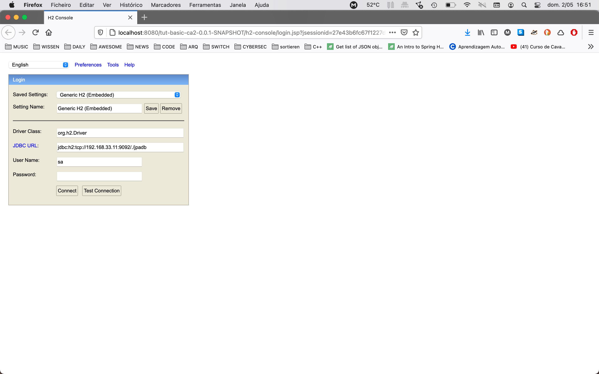
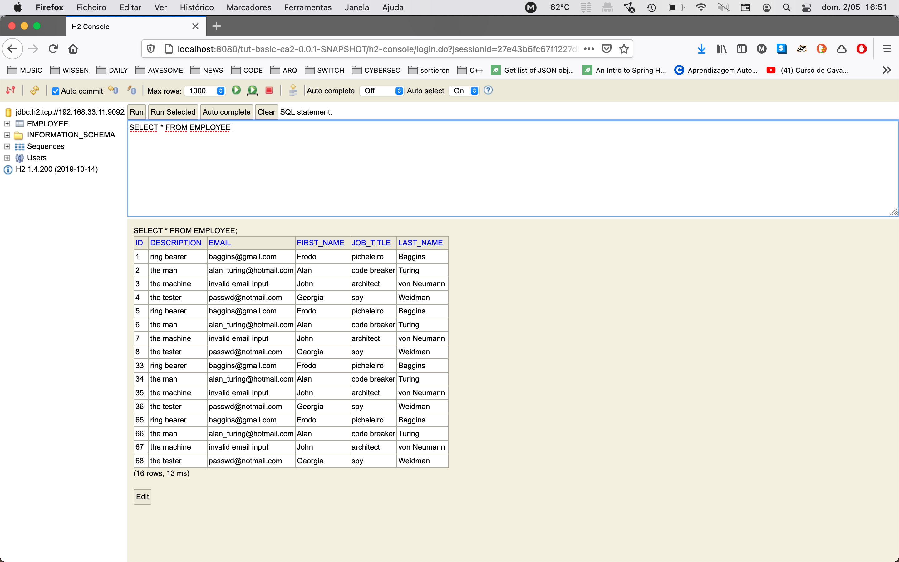
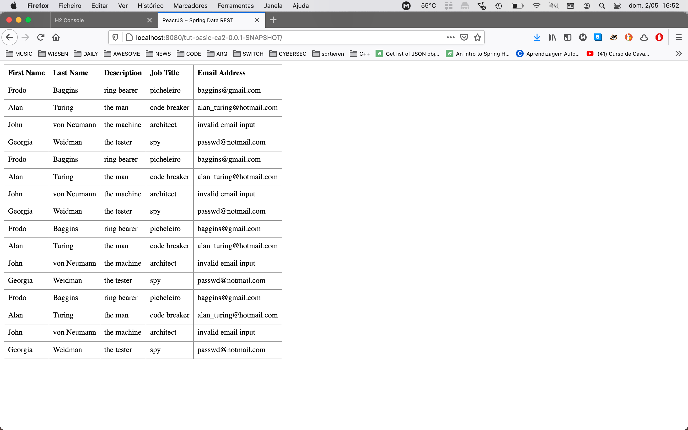

# Class Assignment 3 - part 2 Report

Topic of this assignment: Virtualization with Vagrant

> Use Vagrant to setup a virtual environment to execute the tutorial spring boot application, gradle "basic" version (developed in CA2, Part2)

---

## 1. Analysis, Design and Implementation

### **1.1 Vagrant**

[Vagrant](https://www.vagrantup.com/) is a tool for managing virtual machines (VM) in a single workflow. It is the perfect tool to automate the setup of VM's and so increasing productivity.

All the configuration is made in a single file enabling the main perks of this tool: easy to use, reproducible and portable.
The file called _Vagrantfile_ is a Ruby source file.

For developers and operations engineer this means consistency, predictability and a more standardised testing and developing environment. Whether your team is working on different OS, you can be certain that the code is running always in the same environment.

---

### **1.2 Before the assignment**

This class assignment follows the introduction of Vagrant as a tool.

During the first hour of the class we were introduced to same Vagrant commands.

A quick summary of the main ones will be many in the next lines.

### *1.2.1 Command init*

To initialize in the current directory a Vagrant environment use the following command:

```console
ricardo$ vagrant init [arg1] [arg2]
```

This means the creation of the _Vagrantfile_ that will contain all the configurations.

If you give a first argument, it will prepopulate the `config.vm.box` setting in the created Vagrantfile.
A second argument will prepopulate the `config.vm.box_url` setting.

### *1.2.2 Command box*

> Boxes are the package format for Vagrant environments. A box can be used by anyone on any platform that Vagrant supports to bring up an identical working environment.

To add a box we use the `add` command. A remove command also exists.

### *1.2.3 Command up*

```console
ricardo$ vagrant up
```

This command creates a guest machine according to the configurations specified in the _Vagrantfile_.
If the given box was not yet add to Vagrant it will automatically download it. 

### *1.2.4 Command ssh*

The `ssh` command will SSH into a running Vagrant machine. You can specified the machine you want to access by introducing it's name as the first parameter.

### *1.2.5 Command halt*

The `halt` command stops the VM. It´s the opposite of the `up` command.
There is also a `reload` command that halts and start again the VM.

### *1.2.6 Command status*

The `status` command will tell you the state of the VM that Vagrant is managing.

### *1.2.7 Flag --provision*

If you make some changes in the provision section of the _Vagrantfile_ and the VM is running, you can use the following command to restart it and apply the new changes:

```console
ricardo$ vagrant reload --provision
```

### *1.2.6 Command destroy*

The `destroy` command stops the running machine and eliminates all the resources created for it.

---

### **1.3 Assignment**

### **1.3.1 Create the class assignment folder**

```console
ricardo$ pwd .../devops-20-21-1201779/ca3

ricardo$ mkdir part2

ricardo$ cd !$

ricardo$ touch README.md
```

### **1.3.2 Import initial solution**

```console
ricardo$ git clone https://mendes-r@bitbucket.org/atb/vagrant-multi-spring-tut-demo.git

ricardo$ ls -1
README.md
vagrant-multi-spring-tut-demo

ricardo$ cp ./vagrant-multi-spring-tut-demo/Vagrantfile .

ricardo$ rm -rf vagrant-multi-spring-tut-demo

ricardo$ ls -1
README.md
Vagrantfile
```

### **1.3.3 Edit Vagrant file to use the application from the ca2-part2**

The following lines where changed:

```
1 web.vm.provision "shell", inline: <<-SHELL, privileged: false
2      sudo apt-get install git -y
3      sudo apt-get install nodejs -y
4      sudo apt-get install npm -y
5      sudo ln -s /usr/bin/nodejs /usr/bin/node
6      sudo apt install tomcat8 -y
7      sudo apt install tomcat8-admin -y
8      # If you want to access Tomcat admin web page do the following:
9      # Edit /etc/tomcat8/tomcat-users.xml
10     # uncomment tomcat-users and add manager-gui to tomcat user
11
12     # Change the following command to clone your own repository!
13     git clone https://mendes-r@bitbucket.org/mendes-r/devops-20-21-1201779.git
14     cd devops-20-21-1201779/ca2/part2/tut-basic-ca2
15     chmod u+x gradlew
16     ./gradlew clean build
17     # To deploy the war file to tomcat8 do the following command:
18     sudo cp ./build/libs/tut-basic-ca2-0.0.1-SNAPSHOT.war /var/lib/tomcat8/webapps
19   SHELL
```

The line 13 was changed to clone the right repository.
Line 14 was edit to change the directory where the gradle spring application is located.
Line 18 was changed because the name of the _war_ file was different from the one in the project.

### **1.3.4 Change ca2-part2 application to use the H2 server in the _db_ VM**

For this refactoring this project (https://bitbucket.org/atb/tut-basic-gradle/src/master/) was made available with the description of the necessary main changes.

Here are some of the changes:

**buid.gradel**

```gradle
plugins {
	id 'org.springframework.boot' version '2.4.4'
	id 'io.spring.dependency-management' version '1.0.11.RELEASE'
	id 'java'
	//new version
	id 'org.siouan.frontend' version '1.4.1'
  //support for building war files
	id 'war'
}

...

dependencies {
	implementation 'org.springframework.boot:spring-boot-starter-data-jpa'
	implementation 'org.springframework.boot:spring-boot-starter-data-rest'
	implementation 'org.springframework.boot:spring-boot-starter-thymeleaf'
	runtimeOnly 'com.h2database:h2'
	testImplementation 'org.springframework.boot:spring-boot-starter-test'

	// To support war file for deploying to tomcat
	providedRuntime 'org.springframework.boot:spring-boot-starter-tomcat'
}
```

**application.properties**

```properties
# Update context path 
server.servlet.context-path=/tut-basic-ca2-0.0.1-SNAPSHOT
spring.data.rest.base-path=/api
# Support for h2 console.
# Settings for remote h2
spring.datasource.url=jdbc:h2:tcp://192.168.33.11:9092/./jpadb;DB_CLOSE_DELAY=-1;DB_CLOSE_ON_EXIT=FALSE
spring.datasource.driverClassName=org.h2.Driver
spring.datasource.username=sa
spring.datasource.password=
spring.jpa.database-platform=org.hibernate.dialect.H2Dialect
# So that spring will no drop de database on every execution.
spring.jpa.hibernate.ddl-auto=update
spring.h2.console.enabled=true
spring.h2.console.path=/h2-console
spring.h2.console.settings.web-allow-others=true
```

**app.js**

```javascript
componentDidMount() {
	client({method: 'GET', path: '/basic-0.0.1-SNAPSHOT/api/employees'}).done(response => {
		this.setState({employees: response.entity._embedded.employees});
	});
}
```

**ServletInitializer.java**

```java
package com.greglturnquist.payroll;

import org.springframework.boot.builder.SpringApplicationBuilder;
import org.springframework.boot.web.servlet.support.SpringBootServletInitializer;

//Servlet initializer 
public class ServletInitializer extends SpringBootServletInitializer {

    @Override
    protected SpringApplicationBuilder configure(SpringApplicationBuilder application) {
        return application.sources(ReactAndSpringDataRestApplication.class);
    }
}
```

### **1.3.5 Run VM's**

```console
ricardo$ pwd
.../devops-20-21-1201779/ca3/part2

ricardo$ vagrant status
Current machine states:

db                        poweroff (virtualbox)
web                       poweroff (virtualbox)

This environment represents multiple VMs. The VMs are all listed
above with their current state. For more information about a specific
VM, run `vagrant status NAME`.
```

None of the machines are running.
To start the _db_ machine we can use this command:

```console
ricardo$ vagrant up db
```

To start the other machine use the following command:

```console
ricardo$ vagrant up web
```

We could start booth machines using the _up_ subcommand without any argument.

```console
❯ vagrant status
Current machine states:

db                        running (virtualbox)
web                       running (virtualbox)

This environment represents multiple VMs. The VMs are all listed
above with their current state. For more information about a specific
VM, run `vagrant status NAME`.
```

Booth VM's are now running.

### **1.3.6 Confirmation**

We can now open a web browser, on our host machine, to be able to confirm that everything is running as expected.

First, let's start with the H2 console to check the _db_ VM.

Use:

> http://localhost:8080/tut-basic-ca2-0.0.1-SNAPSHOT/h2-console

or

> http://192.168.33.10:8080/tut-basic-ca2-0.0.1-SNAPSHOT/h2-console



To do the login we need to change the URL to `jdbc:h2:tcp://192.168.33.11:9092/./jpadb`



Also in the host you can open the spring web application using one of the following options:

> http://localhost:8080/tut-basic-ca2-0.0.1-SNAPSHOT

or

> http://192.168.33.10:8080/tut-basic-ca2-0.0.1-SNAPSHOT



Everything looks fine!

## 2. Analysis of an Alternative

The alternative here is not for the VM manager (Vagrant) but the hypervisor. 

### **2.1 Why QEMU**

[Qemu](https://www.qemu.org) is a open-source hypersisor written in C. 
It's a userland type 2 (i.e runs upon a host OS) hypervisor for performing hardware virtualization. That means that it runs direct on the kernel and not on top of an abstraction layer on top of the Host OS

As we will see later, to use Qemu efficiently on my machine (MacbookAir) we need to first install some dependencies.

The [KVM](https://www.linux-kvm.org/page/Main_Page) and [Libvirt](https://libvirt.org/) are some of those dependencies that are recommended to be installed. KVM is a kernel module for Linux to enable virtualization; this is the hypervisor. Qemu could run without it, but can be quite a bit slower. Qemu in this case is a machine emulator.

Has it turns out, KVM will not work in this machine. Fortunately Qemu has now support for HVF, the macOS Hypervisor Framework (HVF); that's essentially a KVM for Macs.

Libvirt is a virtualization library which wraps Qemu and KVM to provide API's for use by other programs, such as Vagrant here.

### **2.2 Pros and Cons**

Qemu has had support for macOS Hypervisor.Framework since 2018. That means a more efficient virtualization. VirtualBox on the other hand has no such support.

Qemu is a lot less user-friendly. It's not based on any GUI but only uses the Command Line Interface (CLI). And in my opinion, for a CLI based program, is also a very complex and verbose one.

Vagrant ships out of the box without support for Qemu/Libvirt. And to integrate Qemu as a Vagrant provider is really hard. Once, it needs a lot of dependencies to run with.

## 3. Implementation of the Alternative

### **3.1 Install necessary dependencies**

```console
ricardo$ brew install qemu libvirt gcc ruby ruby-build rbenv libiconv libxml2
```

This huge list was recommended in this [website](https://github.com/vagrant-libvirt/vagrant-libvirt/issues/818).

### **3.2 Use Qemu without Vagrant**

To be sure that some future problem doesn't reside in Qemu, we will try to use it without Vagrant.

Let's first create a folder to start with the work.

```console
ricardo$ pwd
~/Desktop

ricardo$ mkdir qemu-test

ricardo$ cd !$

ricardo$ pwd
~/Desktop/qemu-test
```

We need to download first an ISO image. We will be using the same used in this class: [link](https://help.ubuntu.com/community/Installation/MinimalCD).

First we need to create a blank disk image. To do that we will be use the `qemu-img` command. Here we'll create a 10 GB qcow2 image to install the Ubuntu OS:  

```console
ricardo$ qemu-img create -f qcow2 ~/Desktop/qemu-test/mini.qcow2 10G
Formatting '/Users/ricardomendes/Desktop/qemu-test/mini.qcow2', fmt=qcow2 cluster_size=65536 extended_l2=off compression_type=zlib size=10737418240 lazy_refcounts=off refcount_bits=16
```

To boot the installation we need to run the command bellow. Here we can define how much memory to allocate for the VM (here we have chosen 2048).

In this small script we also define the cpu type of the host machine and enabled the HVF.
Since the latest update for macOS, Apple has made changes to the hypervisor entitlements.

> Entitlements are key-value pairs that grant an executable permission to use a service or technology. In this case the QEMU binary is missing the entitlement to create and manage virtual machines.

To fix the issue all we have to do is add the entitlement to the qemu-system-x86_64 binary.

First we need to create an XML file:

```xml
<?xml version="1.0" encoding="UTF-8"?>
<!DOCTYPE plist PUBLIC "-//Apple//DTD PLIST 1.0//EN" "http://www.apple.com/DTDs/PropertyList-1.0.dtd">
<plist version="1.0">
<dict>
    <key>com.apple.security.hypervisor</key>
    <true/>
</dict>
</plist>
```

... and run the following command:

```console
ricardo$ codesign -s - --entitlements entitlements.xml --force /usr/local/bin/qemu-system-x86_64
```

Now we can enable HVF without having any errors occurring. [source](https://www.arthurkoziel.com/qemu-on-macos-big-sur/)


To boot we must now run this command:

```console
ricardo$ qemu-system-x86_64 \
  -machine accel=hvf \
  -cpu Nehalem \
  -smp 2 \
  -hda mini.qcow2 \
  -cdrom ./mini.iso \
  -m 4G \
  -vga virtio \
  -usb \
  -device usb-tablet \
  -display default,show-cursor=on 
```


### **3.3 Edit Vagrantfile**

As we described in chapter 2.1, to be able to use Qemu with Vagrant we need to install the _Libvirt_ plugin first:

```console
ricardo$ vagrant plugin install vagrant-libvirt

...

ricardo$ vagrant plugin list
vagrant-libvirt (0.4.1, global)
```

The next step would be to edit the configuration file.

The initial Vagrant box isn't compatible with _Libvirt_. So we need to search for an alternative. The box [nrclark/xenial64-minimal-libvirt](https://app.vagrantup.com/nrclark/boxes/xenial64-minimal-libvirt) seems to be perfect.

We also need to change the provider in our Vagrantfile. We will try first to only run the _web_ VM with Qemu.
Here are the modifications

```ruby
#============
    # Configurations specific to the webserver VM
    config.vm.define "web" do |web|
      web.vm.box = "nrclark/xenial64-minimal-libvirt"
      web.vm.hostname = "web"
      web.vm.network "private_network", ip: "192.168.33.10"
 
      # We set more ram memmory for this VM
      web.vm.provider :libvirt do |v|
        v.memory = 1024
      end

      ...
```

### **3.4 Start VM**

Now to the horrendous finale.

I tried to run the VM and I received after so much work and research the next message:

```console
ricardo$  vagrant up --provider=libvirt web

Bringing machine 'web' up with 'libvirt' provider...
Error while connecting to Libvirt: Error making a connection to libvirt URI qemu:///system?socket=/var/run/libvirt/libvirt-sock:
Call to virConnectOpen failed: Failed to connect socket to '/var/run/libvirt/libvirt-sock': No such file or directory
```

### **3.5 The Problems**

After some hours of searching, I couldn't find a solution for this problem.
Most of the help that I found was focused for Linux distributions.

I tried to run the last command with `sudo` because it worked with some people reporting this problem. But it didn´t work.

If we read the error message it give us some clues about how we can maybe fix this.

The _libvirt-sock_ file is missing in my machine and it should be placed there by the _libvirt daemon_.
To solve this, I tried to start the _daemon_ manually:

```console
ricardo$ /usr/local//Cellar/libvirt/7.2.0/sbin/libvirtd

2021-05-04 17:14:00.436+0000: 123145320570880: info : libvirt version: 7.2.0
2021-05-04 17:14:00.436+0000: 123145320570880: info : hostname: MacBook-Air-de-Ricardo.local
2021-05-04 17:14:00.436+0000: 123145320570880: warning : virProcessGetStartTime:1200 : Process start time of pid 2302 not available on this platform
2021-05-04 17:14:00.447+0000: 123145320570880: error : virGDBusGetSessionBus:128 : internal error: Unable to get session bus connection: Impossível criar um canal de mensagem sem um id de máquina: Incapaz de carregar /usr/local/var/lib/dbus/machine-id ou /etc/machine-id: Falha ao abrir o ficheiro “/usr/local/var/lib/dbus/machine-id”: No such file or directory
2021-05-04 17:14:00.447+0000: 123145320570880: error : virGDBusGetSystemBus:101 : internal error: Unable to get system bus connection: Impossível ligar: No such file or directory
```

So I tried with `sudo`:

```console
ricardo$ sudo /usr/local//Cellar/libvirt/7.2.0/sbin/libvirtd

Password:
2021-05-04 17:14:58.578+0000: 123145432027136: info : libvirt version: 7.2.0
2021-05-04 17:14:58.578+0000: 123145432027136: info : hostname: MacBook-Air-de-Ricardo.local
2021-05-04 17:14:58.578+0000: 123145432027136: warning : virProcessGetStartTime:1200 : Process start time of pid 2315 not available on this platform
2021-05-04 17:14:58.583+0000: 123145432027136: error : virExec:638 : Cannot find 'dmidecode' in path: No such file or directory
2021-05-04 17:14:58.590+0000: 123145432027136: error : virFileFindHugeTLBFS:3593 : this function is not supported by the connection driver: virFileFindHugeTLBFS

```

The missing file as appear.

```console
ricardo$ ls /usr/local/var/run/libvirt/
hostdevmgr		libvirt-sock-ro		secrets
libvirt-admin-sock	lockd			storage
libvirt-sock		qemu
```

But I cannot still start the VM... and it gives the same error: "`Call to virConnectOpen failed: Failed to connect socket to 'qemu:///system?socket=/usr/local/var/run/libvirt/libvirt-sock': No such file or directory`"

The next step was to manually override the Libvirt URI. To do that we need to modify the Vagrantfile and add: `v.socket = '/usr/local/var/run/libvirt/libvirt-sock'`

So one more push...

```console
ricardo$ vagrant up --provider=libvirt web

Bringing machine 'web' up with 'libvirt' provider...
Error while connecting to Libvirt: Error making a connection to libvirt URI qemu:///system?socket=/usr/local/var/run/libvirt/libvirt-sock:
Call to virConnectOpen failed: Failed to connect socket to '/usr/local/var/run/libvirt/libvirt-sock': Permission denied
```

Different error. It seem that I don´t have permission. 

### **3.6 A Partial Solution**

It's `sudo` time!

```console
ricardo$ sudo vagrant up --provider=libvirt web

Password:
Bringing machine 'web' up with 'libvirt' provider...
==> web: Box 'nrclark/xenial64-minimal-libvirt' could not be found. Attempting to find and install...
    web: Box Provider: libvirt
    web: Box Version: >= 0
==> web: Loading metadata for box 'nrclark/xenial64-minimal-libvirt'
    web: URL: https://vagrantcloud.com/nrclark/xenial64-minimal-libvirt
==> web: Adding box 'nrclark/xenial64-minimal-libvirt' (v1.1.1) for provider: libvirt
    web: Downloading: https://vagrantcloud.com/nrclark/boxes/xenial64-minimal-libvirt/versions/1.1.1/providers/libvirt.box
Progress: 1% (Rate: 960k/s, Estimated time remaining: 0:06:41)
...
```

Alleluia! That's a nice reward for all the work.

All this was tried while having the _daemon_ running.

Unfortunately this happened:

```console
==> web: Successfully added box 'nrclark/xenial64-minimal-libvirt' (v1.1.1) for 'libvirt'!
==> web: Uploading base box image as volume into Libvirt storage...
==> web: Creating image (snapshot of base box volume).
==> web: Creating domain with the following settings...
==> web:  -- Name:              part2-alternative_web
==> web:  -- Domain type:       kvm
==> web:  -- Cpus:              1
==> web:  -- Feature:           acpi
==> web:  -- Feature:           apic
==> web:  -- Feature:           pae
==> web:  -- Clock offset:      utc
==> web:  -- Memory:            1024M
==> web:  -- Management MAC:
==> web:  -- Loader:
==> web:  -- Nvram:
==> web:  -- Base box:          nrclark/xenial64-minimal-libvirt
==> web:  -- Storage pool:      default
==> web:  -- Image:             /var/lib/libvirt/images/part2-alternative_web.img (10G)
==> web:  -- Disk driver opts:  cache='default'
==> web:  -- Kernel:
==> web:  -- Initrd:
==> web:  -- Graphics Type:     vnc
==> web:  -- Graphics Port:     -1
==> web:  -- Graphics IP:       127.0.0.1
==> web:  -- Graphics Password: Not defined
==> web:  -- Video Type:        cirrus
==> web:  -- Video VRAM:        9216
==> web:  -- Sound Type:
==> web:  -- Keymap:            en-us
==> web:  -- TPM Backend:       passthrough
==> web:  -- TPM Path:
==> web:  -- INPUT:             type=mouse, bus=ps2
Error while creating domain: Error saving the server: Call to virDomainDefineXML failed: invalid argument: could not get preferred machine for /usr/local/bin/qemu-system-x86_64 type=kvm
```

To fix this error we need to add another line to the Vagrantfile to specify the hypervisor: `v.driver = "qemu"`

But...

```console
ricardo$ sudo vagrant up --provider=libvirt web
Bringing machine 'web' up with 'libvirt' provider...
==> web: Checking if box 'nrclark/xenial64-minimal-libvirt' version '1.1.1' is up to date...
Traceback (most recent call last):
	49: from /opt/vagrant/embedded/gems/2.2.15/gems/vagrant-2.2.15/lib/vagrant/batch_action.rb:86:in `block (2 levels) in run'
	48: from /opt/vagrant/embedded/gems/2.2.15/gems/vagrant-2.2.15/lib/vagrant/machine.rb:201:in `action'

...

	 1: from /Users/ricardomendes/.vagrant.d/gems/2.6.6/gems/vagrant-libvirt-0.4.1/lib/vagrant-libvirt/util/network_util.rb:122:in `libvirt_networks'
/Users/ricardomendes/.vagrant.d/gems/2.6.6/gems/vagrant-libvirt-0.4.1/lib/vagrant-libvirt/util/network_util.rb:122:in `list_networks': Call to virConnectNumOfNetworks failed: this function is not supported by the connection driver: virConnectNumOfNetworks (Libvirt::RetrieveError)
```

Here I reached a wall. After some research it seem that the Vagrant plugin won't work in most scenarios which require any network configuration in QEMU (and need these libvirt API calls).

THE END
