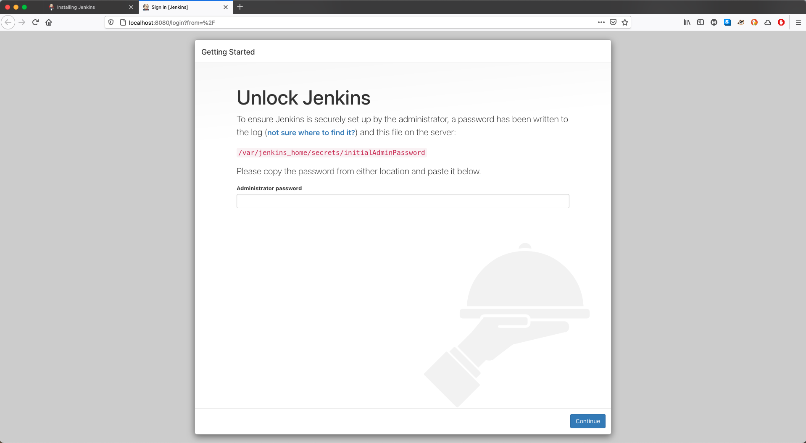
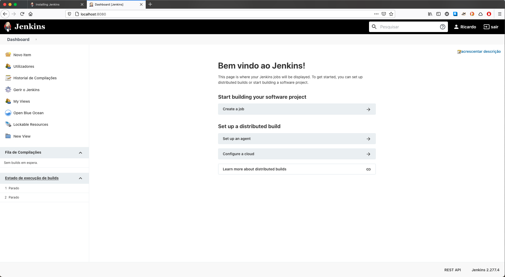
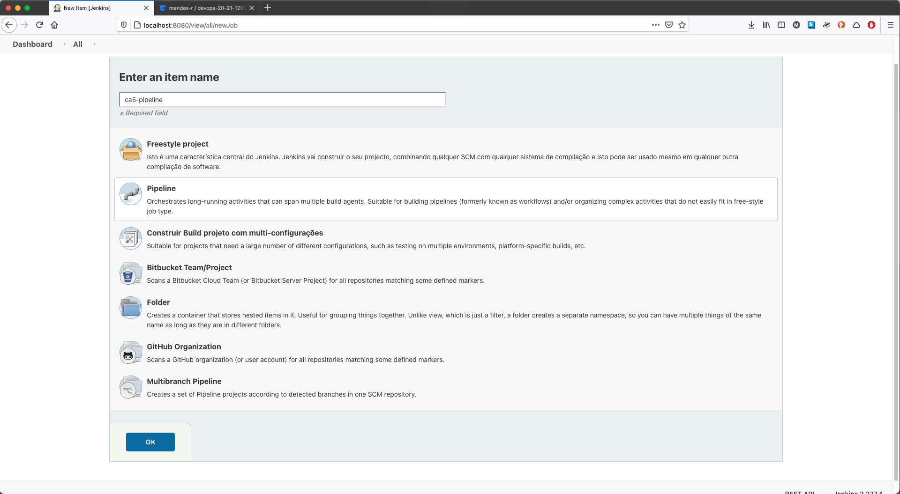
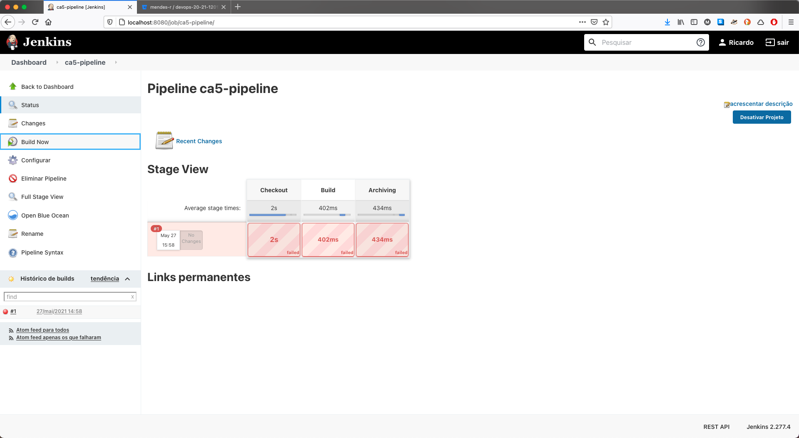
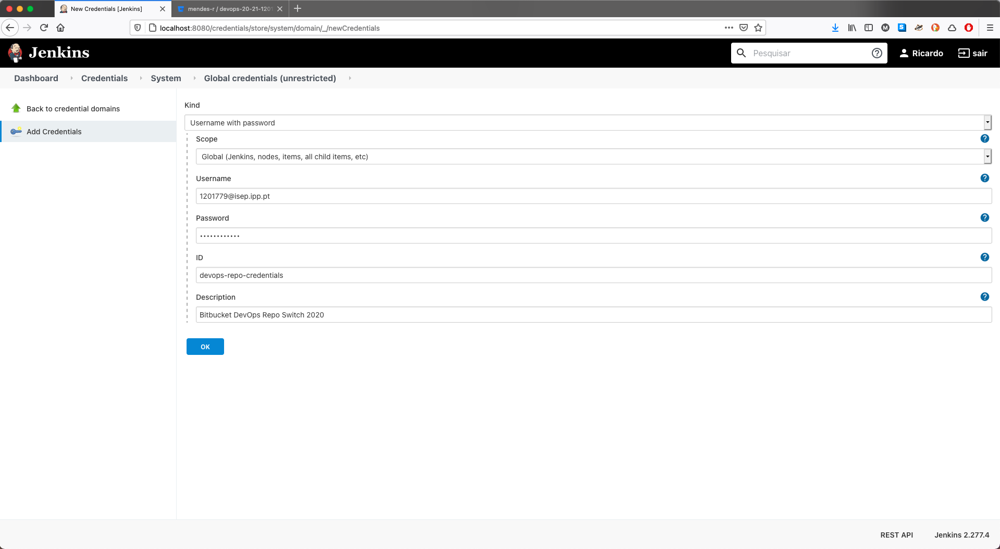
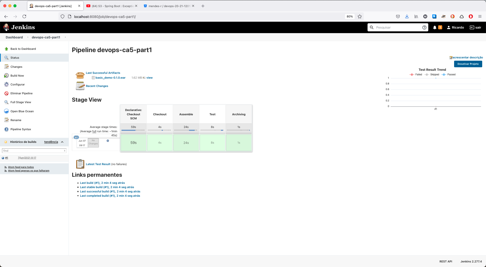
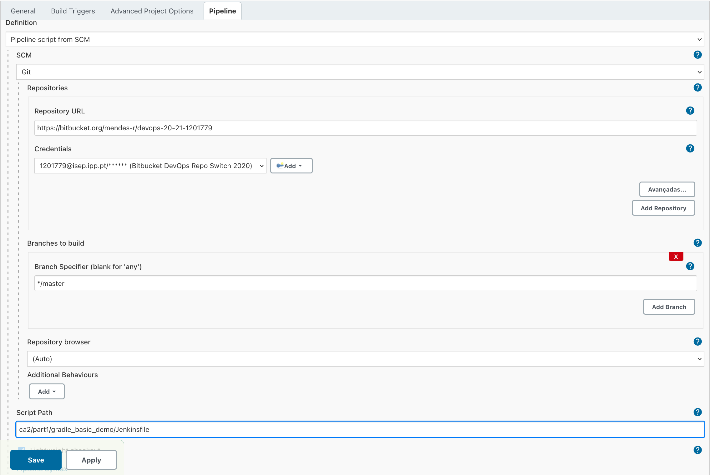
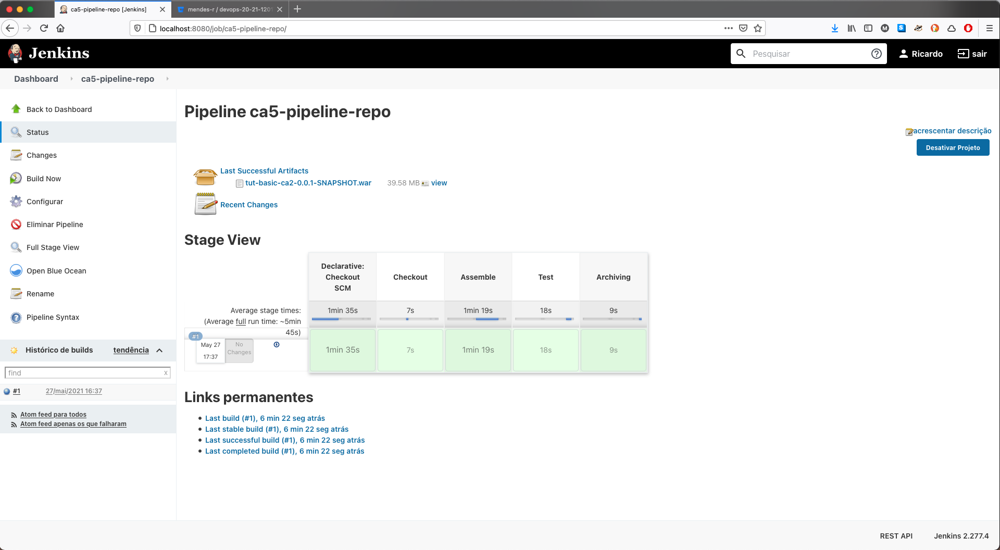

# **Class Assignment 5 - part 1**

> Topic of this assignment: CI/CD Pipelines with Jenkins

The goal of the Part 1 of this assignment is to practice with Jenkins using the "gradle basic demo" project that should already be present in the student’s individual repository.

---

## **1. Analysis, Design and Implementation**

## **1.1 The tool**

[Jenkins](https://www.jenkins.io/) is an open source automation server written in Java, that has a big community and documentation that provides hundreds of plugins to support building, deploying and automating any project.

Jenkins is the most famous Continuous Integration tool and is almost synonym of it. It also allows to continuously deliver your software by integrating with a large number of testing and deployment technologies.

It's easy to use (a not so steep learning curve) and highly customizable.

---

## **1.2 Class assignment**

## **1.2.1 Starting Jenkins**

We have decided to use a jenkins container to run our Jenkins server.

```console
ricardo$ docker pull jenkinsci/blueocean
Using default tag: latest
latest: Pulling from jenkinsci/blueocean
339de151aab4: Pull complete
ca3c1c780f80: Pull complete
97efe98a0b69: Pull complete
edeed36745c3: Pull complete
ac0ada7245f0: Pull complete
d8284d1fba84: Pull complete
02c517d56609: Pull complete
892b25896a82: Pull complete
ee53f447f0aa: Pull complete
0a57e82bc49b: Pull complete
6a5d1fb00167: Pull complete
c63eb4277ae6: Pull complete
3769c4123525: Pull complete
6e2b88f6bd38: Pull complete
251776fb1c78: Pull complete
bd195d501ba9: Pull complete
Digest: sha256:8115c43b8c1362769b415c315a321ddb95ec0b9f982cb11f3e8f72070d5bf4fd
Status: Downloaded newer image for jenkinsci/blueocean:latest
docker.io/jenkinsci/blueocean:latest
```

After pulling the image and reading the documentation we decide to create a small script to enable us start the server painlessly.

```console
ricardo$ touch start-jenkins.sh
ricardo$ sudo chmod +x start-jenkins.sh
Password:
```

Here is the content of the script:

```bash
#!/bin/zsh

CONTAINER_NAME=jenkins-container
LOG_NAME=jenkins-container.log
  
docker run -u root --rm -d -p 8080:8080 -p 50000:50000 -v $HOME/jenkins:/var/jenkins_home -v /var/run/docker.sock:/var/r    un/docker.sock --name $CONTAINER_NAME jenkinsci/blueocean

docker logs -f $CONTAINER_NAME >& $LOG_NAME
```

The log file is here just to help debugging some future problems.

---

## **1.2.2 Initialize Jenkins**

So, to access Jenkins we go to our browser and type ```localhost:8080```.




That was easy to set up. Just reading the instruction was enough.

---

## **1.2.3 Create the Pipeline**

To enable a more easy and quick way to set up our pipeline, we have chosen to write the Jenkins instructions in the server and not yet in a Jenkinsfile inside the project.

First we need to create an Item and define ir as a pipeline.



After that we insert our pipeline script in agreement with this class assignment.

Below we can see the first try.

```jenkins  
pipeline { 
    agent any

    stages { 
        stage('Checkout') {
            steps {
                echo 'Checking out...'
                git 'https://bitbucket.org/mendes-r/devops-20-21-1201779'
            }
        }

        stage('Assemble') {
            steps {
                echo 'Assembling...'
                sh './gradlew clean bootWar'
            }      
        }

        stage('Test') {
            steps {
                echo 'Testing...'
                sh './gradlew test' 
                junit 'build/test-results/**/*.xml'
            }      
        }

        stage('Archiving') { 
            steps {
                echo 'Archiving...'
                archiveArtifacts 'build/libs/*'
            }
        } 
    }
}
```

- The first stage - _Checkout_ - should clone our repository.
- Second stage should compile and produce the archive files with the application. In this case is a _WAR_ file.
- The third stage should execute the unit tests and publish in Jenkins the test results.
- The last stage archives in Jenkins the archive files generated during Assemble.

---

## **1.2.4 First Build**

Having now defined the script, we can try our first build by clicking on the _Build Now_ button.



And it failed!
Let's look at the logs.

```console
(...)
No credentials specified
Cloning the remote Git repository
Cloning repository https://bitbucket.org/mendes-r/devops-20-21-1201779/src/master/ca2/part2/tut-basic-ca2/
 > git init /var/jenkins_home/jobs/ca5-pipeline/workspace # timeout=10
Fetching upstream changes from https://bitbucket.org/mendes-r/devops-20-21-1201779/src/master/ca2/part2/tut-basic-ca2/
 > git --version # timeout=10
 > git --version # 'git version 2.26.3'
 > git fetch --tags --force --progress -- https://bitbucket.org/mendes-r/devops-20-21-1201779/src/master/ca2/part2/tut-basic-ca2/ +refs/heads/*:refs/remotes/origin/* # timeout=10
ERROR: Error cloning remote repo 'origin'
hudson.plugins.git.GitException: Command "git fetch --tags --force --progress -- https://bitbucket.org/mendes-r/devops-20-21-1201779/src/master/ca2/part2/tut-basic-ca2/ +refs/heads/*:refs/remotes/origin/*" returned status code 128:
stdout: 
stderr: remote: Invalid username or password
fatal: Authentication failed for 'https://bitbucket.org/mendes-r/devops-20-21-1201779/src/master/ca2/part2/tut-basic-ca2/'
(...)
```

Because the remote repository is private we need to insert the credentials só thats we can be authenticated as a valid user.

To do this we can add the credentials in Jenkins in a safe way.



So let's try again, but this time with a little tweak in our script so that it recognize the credentials that we add to Jenkins. 

The ID that we specified earlier is what we need to insert in the _Checkout_ stage

```jenkins
stage('Checkout') {
    steps {
        echo 'Checking out...'
        git credentialsId: 'devops-repo-credentials', url: 'https://bitbucket.org/mendes-r/devops-20-21-1201779'
    }
}
```

---

## **1.2.5 Second Attempt**

On the second attempt we run into a second problem.

This time the _log_ tell uns that during the _Assemble_ stage it couldn't find te _./gradlew_ file.

That makes sense, because we have nowhere defined a working directory. We want to make a _war_ file from a specific application and not from the repository itself.

After same research we found the _dir_ step that does exactly what we wanted. For each step we specify the working directory:

```jenkins
stage('Assemble') {
    steps {
        dir('ca2/part2/tut-basic-ca2/') {
            sh 'pwd'
            sh 'ls -1'
            echo 'Assembling...'
            sh './gradlew clean bootWar'
        }
    }      
}
stage('Test') {
      steps {
         dir('ca2/part2/tut-basic-ca2/') {
            echo 'Testing...'
            sh './gradlew test'
            junit 'build/test-results/**/*.xml'
        }
    }      
}
stage('Archiving') { 
    steps {
        dir('ca2/part2/tut-basic-ca2/') {
            echo 'Archiving...'
            archiveArtifacts 'build/libs/*'
        }
    }
} 
```

So all the necessary steps that need to be done must me defined inside the directory.

We could have defined a variable in our script to set the path.

```jenkins
environment {
    WORKING_DIR = 'ca2/part2/tut-basic-ca2/'
}
```

---

## **1.2.6 Third Attempt**

Let's try again



And it worked. Great job!

We can see in the image a little graph on the right side that shows the test results. The _junit_ step inside the _Test_ stage worked fined. We just needed to specified the path of the results and the rest was automatic.

The same is true with the archiving. The _archiveArtifacts_ step just needed the path of the file that we wanted to archive. And as we can see, also in the image, our _war_ file was stored.

---

## **1.2.7 Add script to the repository**

Now that we know that the script is working, we can create a Jenkinsfile and add it to the repository.

There is a difference now on how we create a pipeline.

We need to give our repository URL, the credentials (already added during the first stages) and specify the location of the _Jenkinsfile_.



And has we can see below everything worked well.



---

THE END
