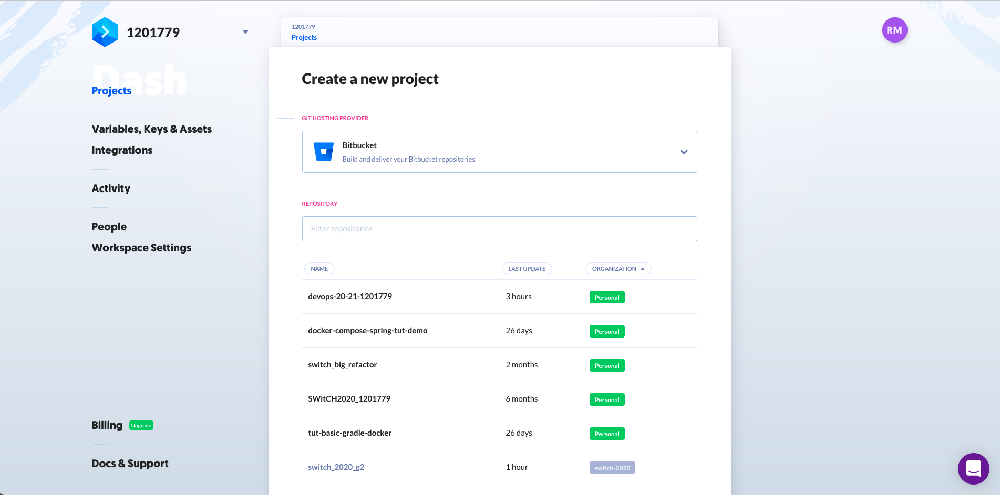

# **Class Assignment 5 - part 2**

> Topic of this assignment: CI/CD Pipelines with Jenkins

The goal of the Part 2 of this assignment is to create a pipeline in Jenkins to build the tutorial spring boot application, gradle "basic" version (developed in CA2, Part2)

---

## **1. Analysis, Design and Implementation**

## **1.1 The tool**

A description of the tool can be found in class assignment 5 part 1.

---

## **1.2 Class assignment**

As an intro, this class assignment is in parte very similar to the class assignment 5 part 1.

The main differences are in some of the stages.
We need now to publish the _javadoc_ in Jenkins and we need to generate a docker image with _Tomcat_ and the _war_ file,and publish it in the Docker Hub.

As we don't want to repeat our self we will just describe in detail the stages that are new in this assignment.

---

## **1.2.1 Javadoc**

As in the previous class assignment we need to use the _dir_ step to define our working directory.

To publish the _javadoc_ we need to generated first.
To do this, we run the command `./gradlew javadoc`. The sub-command is a predefined gradle task that generates all the files that compose the documentation.

This files are stored inside the _build_ folder. This is something that we need to know to be able to retrieve them and publish them.

The _publish_ step is done with the [HTML Publisher plugin](https://www.jenkins.io/doc/pipeline/steps/htmlpublisher/).

On reading some of the available documentation, we found the  following solution that already includes the topica/steps described above.

```jenkins
stage('Javadoc') {
    steps {
        dir('ca2/part2/tut-basic-ca2/') {
            echo 'Javadoc...'
            sh './gradlew javadoc'
            publishHTML target: [
                allowMissing: false,
                alwaysLinkToLastBuild: false,
                keepAll: true,
                reportDir: 'build/docs/javadoc',
                reportFiles: 'index.html',
                reportName: 'Javadoc'
            ]
        }
    }
}
```

Inside the _publishHTML_ step we will find some configurations:

- The _allowMissing_, if true, allow the report to be missing without blowing the build.
- The _alwaysLinkToLastBuild_, if true, publish the link on project level even if build failed.
- The _keepAll_, if checked, archive reports for all successful builds, otherwise only the most recent.
- The _reportDir_ defines the path to the HTML report directory.
- The _reportFiles_ defines the file to provide links inside the report directory.
- The _reportName_ specifies a name for the report to be identified in the build.

To be able to view the _javadoc_ after the build, we need to make a little tweak.

This happens because of the default content security policy. Jenkins applies restrictions to potentially untrusted files.

No local _Manage Jenkins_ temos a opção de abrir uma consola de modo a inserir este script:

```console
System.setProperty("hudson.model.DirectoryBrowserSupport.CSP", "")
```


If the script runs correctly we can now access the published _javadoc_.


## **1.2.2 Docker**

Now the really difficult part.

As mentioned before, this _stage_ tries to generate a docker image with _Tomcat_ and the _war_ file and also publish it in the Docker Hub.

This step took many iteration and a lot of research to be fully functional.

The main problem was the unfamiliarity with the script sintax. But after some time it turn to be really easy.

Below is the final result:

```jenkins
stage('Pushing image') {
    steps {
        dir ('ca2/part2/tut-basic-ca2/') {
            echo 'Pushing the image...'
            script {
                def dockerImage = docker.build("isepmendes/devops2020:${env.BUILD_ID}")
                docker.withRegistry( '' , 'dockerHubCredentials') {
                dockerImage.push()
                }
            }
            sh "docker rmi isepmendes/devops2020:${env.BUILD_ID}"
        }
    }
}
```

Being more specific...

First we need to define a new credential that includes username and password of our _Docker Hub_ account.


The next step was to create a Dockerfile with the class assignment requirements.

```docker
FROM tomcat

RUN apt-get update -y
RUN apt-get install -f
RUN apt-get install git -y
RUN apt-get install nodejs -y
RUN apt-get install npm -y

RUN mkdir -p /tmp/build

ADD build/libs/tut-basic-ca2-0.0.1-SNAPSHOT.war /usr/local/tomcat/webapps/

EXPOSE 8080
```

The _ADD_ command just copies the _war_ file from the source to the filesystem of the image at the specified path.
Here the source path was defined by the _dir_ step that was already describe in the readme file for the class assignment 5 part 1.

The location of the Dockerfile in the repostiory is inside the ca2-part2 project's folder.

## **1.2.5 The docker script**

Let's analyze in more detail the script that enable us to build an image from a Dockerfile and push it to a repository in the Docker Hub.

```script
script {
    def dockerImage = docker.build("isepmendes/devops2020:${env.BUILD_ID}")
    docker.withRegistry( '' , 'dockerHubCredentials') {
    dockerImage.push()
    }
}
```

The first line builds an image from the Dockerfile. The same line defines also the name of the image. The username and repository name are added to the image's name and also a tag with the build number. The variable $BUILD_ID, as the [documentation](https://www.jenkins.io/doc/book/pipeline/jenkinsfile/) describes, stores the build number.

The second line handles the connection with the Docker Hub. The first parameter is the Registry URL and the second the credentials. As we can see, for Docker Hub, the URL isn´t needed.

The third line that is actually inside the second line, gives the order to push the image.

One last step was added.

To avoid having a new image in our machine each time we make a build in Jenkins, we add a command to delete the image that was pushed.

The command is really simple and already discussed during the 4th class assignment:

```console
sh "docker rmi isepmendes/devops2020:${env.BUILD_ID}"
```

One extra requirement is to install the necessary plugins. To be able to run the above mentioned script we installed the following plugins:

- Docker plugin,
- Docker Pipeline,
- docker-build-step.


## **1.2.4 Complete Jenkinsfile**

Here is the complete script.

```console
pipeline { 
     agent any

     stages { 
         stage('Checkout') {
             steps {
                 echo 'Checking out...'
                 git credentialsId: 'devops-repo-credentials', url: 'https://bitbucket.org/mendes-r/devops-20-21-1201779'
             }
         }       

         stage('Assemble') {
             steps {
                 dir('ca2/part2/tut-basic-ca2/') {
                     sh 'pwd'
                     sh 'ls -1'
                     echo 'Assembling...'
                     sh './gradlew clean bootWar'
                 }
             }      
         }
        
         stage('Test') {
             steps {
                 dir('ca2/part2/tut-basic-ca2/') {
                     echo 'Testing...'
                     sh './gradlew test'
                     junit 'build/test-results/**/*.xml'
                 }
             }   
         }
         
        stage('Javadoc') {
            steps {
                dir('ca2/part2/tut-basic-ca2/') {
                    echo 'Javadoc...'
                    sh './gradlew javadoc'
                    publishHTML target: [
                        allowMissing: false,
                        alwaysLinkToLastBuild: false,
                        keepAll: true,
                        reportDir: 'build/docs/javadoc',
                        reportFiles: 'index.html',
                        reportName: 'Javadoc'
                    ]
                }
            }
        }

        stage('Archiving') { 
             steps {
                 dir('ca2/part2/tut-basic-ca2/') {
                     echo 'Archiving...'
                     archiveArtifacts 'build/libs/*.war'
                 }
             }
         } 
         
        stage('Pushing image') {
            steps {
                dir ('ca2/part2/tut-basic-ca2/') {
                    echo 'Pushing the image...'
                    script {
                        def dockerImage = docker.build("isepmendes/devops2020:${env.BUILD_ID}")
                        docker.withRegistry( '' , 'dockerHubCredentials') {
                        dockerImage.push()
                        }
                    }
                    sh "docker rmi isepmendes/devops2020:${env.BUILD_ID}"
                }
            }
        }
    }
}
```

We put this script in a JenkinsFile a add it to the source directory of the _tut-basic-ca2_ project inside the `ca2/part2` folder.

Afterward a new pipeline was created.


And now our "first" build.


To be sure that everything worked fine we need to look on our Docker Hub to see if the image is there.


Wonderfull!

We can see in the image above that we have a image with the tag _24_.

Now let´s check if the image is still on our machine:

```console
ricardo$ docker images
REPOSITORY              TAG       IMAGE ID       CREATED          SIZE
isepmendes/devops2020   23        c69f022dceb1   40 minutes ago   1GB
isepmendes/devops2020   22        764f4cd61edc   51 minutes ago   1GB
jenkinsci/blueocean     latest    441cd6794e27   4 hours ago      697MB
<none>                  <none>    c1b36316e23f   11 days ago      904MB
ubuntu                  latest    7e0aa2d69a15   7 weeks ago      72.7MB
```

Also wonderful!

It works.

---

## **2. Analysis of an Alternative**

## **2.1 Buddy**

[Buddy](https://buddy.works) is an automation platform that is spectacularly easy to use. It's very intuitive an almost doesn't need any type of scripting.

One of the peculiarities of Buddy is that it is a totally web-based and self-hosted continuous integration and delivery software. That makes it really quick to set up.

What we call _stage_ in Jenkins, Buddy calls _action_... and there are a lot of pre-configure action that encompass building tools like Gradle and Maven, Docker and Heroku, Bash and Shell, file transfer protocols, Node, Go, AWS, DigitalOcean, Azure and a lot more.

All this comes with a cost, and I'm not talking about the short 14 days free trial.

The simplicity and the pre-configure _actions_ makes Buddy not very customizable. It lacks some detailed functionality that are essential in a more professional approach to the DevOps culture. A good example is the publishing of the _javadoc_ and the displaying of the test results.

Another motive for this limitations, apart from a more user-friendly environment, is the web-based and self-hosted characteristic. The use of storage space in the cloud, makes the archiving of files on the server not a functionality that you want to enable to your users.

As a final thought, I think that Buddy is a great tool to introduce all the concepts and flows during a continuous integration and deployment strategy. But for more demanding projects Buddy is maybe not the right choice because of the lack of more versatile plugins.

---

## **3. Implementation of the Alternative**

## **3.1 Start with Buddy**

To start using Buddy we just need to create an account. Is that easy.

The next step is to create a project with an associated repositories; in this case with Bitbucket.



As we can see, we are presented with a list of repositories. In this case we will select the one dedicated to the class assignments: _devops-20-21-1201779_.

---

## **3.2 The Pipeline**

Inside the project, we are now able to create a pipeline.


We just need to specify a name, a trigger mode, and which branch triggers the pipeline.

For this class assignment we selected the manual mode.

---

## **3.3 Actions**

As already mentioned, the _stages_ in Jenkins are the _actions_ in Buddy.


Having a pipeline we can now add _action_ to it. There is a great selection of action, but for now we just want to be able to run our build tool, Gradle.


By selecting the _Gradle action_, we can personalize some aspects of it.

In the _Run_ tab we can enter the command that we want to use. In this case we want to create a _war_ file from the ca2-part2.

An alternative would be to select a _Local Shell action_ and run the _gradle wrapper_ command.

Another important specification is done inside the _Cache_ tab.


Here we can specify the working directory.

---

## **3.4 Docker**

Integration with Docker is easier compared to Jenkins.

On the _Docker Image action_ we need to specify the path and also the context of the valid working directory of the _Dockerfile_.


After that and inside the _Options_ tab, we specify the docker registry, in this case Docker Hub.


Is during this step that we need to add our credentials to be able to integrate Docker.


Very easy to use!

---

## **3.4 Build**

The GUI is very appealing and enable us to have an interactive view of all the process.


The is also a quick way to see the logs of each step, making this kind of reading a lot more easy.

One of the interesting things that wasn't so intuitive here, was to use the build number for the tagging of the Docker image.

After some build, the solution was to create a variable that on each build was incremented by one.


After some thought, the action that was responsible for the increment, was put at the beginning. There is also the possibility to always run this action even when a previous action fails.

---

## **3.5 Overview**

This is the complete pipeline.


We were not able to publish the javadoc or have a graph with the test results.

One way to answer this, was to send by email the test report created during the _gradle test_ command, but only if the pipeline fails. If a test fails, the action also fails.

It's not the optimal solution, but it shows the with Buddy there is some degree of customization.

---

THE END